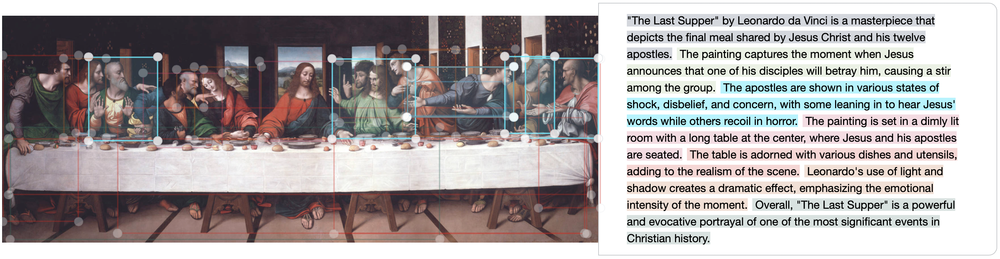

# ArtExplorer
This project aim to do Visual Grounding for Cultural Heritage domain.

This repo contains a demo developed in a context of a thesis work. 
The project task was to develop an application that "analyze" an 
artwork. Do an analysis (for this project) means to
match regions of the artwork and portion of its description. 
Region of the image and portion of the description that matches, 
are highlights with the same color. 

## Installation
In order to install the demo, you need to clone this repository
and install all the dependencies.

The demo uses [OpenCLIP](https://github.com/mlfoundations/open_clip) to 
do the analysis and many other neural network to extract the 
regions. In order to install the dependencies, we suggest to use [Conda](https://www.anaconda.com):

`$ conda install --file requirements.txt`

There are other two requirements:
 - download the `ViT-H SAM model` file from [here](https://dl.fbaipublicfiles.com/segment_anything/sam_vit_h_4b8939.pth)
 - create a `OpenAI API Key` from [here](https://platform.openai.com)

## Configuration
Open the file `config.ini`. 

Insert the path to the `ViT-H SAM model`
downloaded before and the `OpenAI API Key` created.

## Running
To use this demo, you have to use the [Flask](https://flask.palletsprojects.com/) 
server:

 - set the environment variable: `export FLASK_APP=web/main.py`
 - run the Flask server: `$ python3 -m flask run`